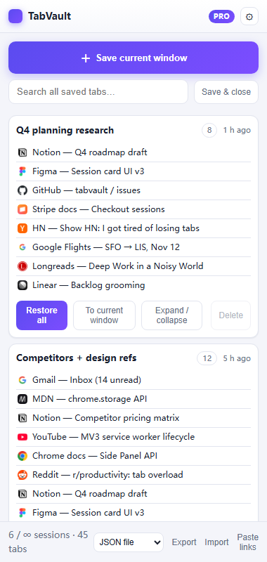
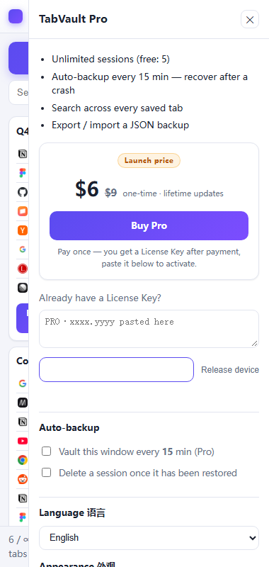
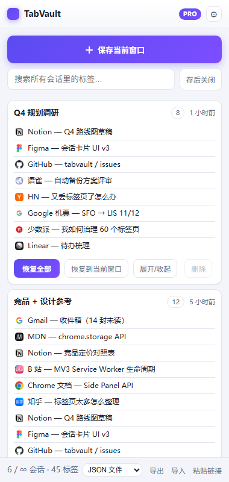

# TabVault — 标签会话管理器（Chrome 扩展）

一键把整个窗口的标签存成「会话」，随时全部恢复；Pro 每 15 分钟自动备份，
崩溃 / 误关窗口后再也不丢标签页。纯本地存储（`chrome.storage.local`）、零后端、
零第三方 API，免费 + Pro 一次性买断（$6 起售价，划线锚定 $9），Pro 用 HMAC License Key 本地验签门控。

## 界面预览

| Pro（英文界面） | 付费墙 | Pro（中文界面） |
|---|---|---|
|  |  |  |

> 本地预览：浏览器直接打开 `sidepanel.html?demo=pro`（或 `=free` / `=paywall`），
> 加 `&lang=en` / `&lang=zh` 强制切换语言、`&theme=light` / `&theme=dark` 强制切换主题。
> 页面内置开发桩，不影响真实扩展环境。
> 界面语言默认跟随浏览器（`navigator.language`），主题默认跟随系统（`prefers-color-scheme`），
> 两者都可在设置抽屉里手动固定；文案在 [`i18n.js`](i18n.js)、配色在
> [`sidepanel.css`](sidepanel.css) 顶部的 token 表（浅色只覆盖 `:root[data-theme="light"]` 一段）。

---

## 1. 本地加载（先看效果）

1. Chrome 地址栏输入 `chrome://extensions`
2. 右上角打开 **开发者模式**
3. 点 **加载已解压的扩展程序** → 选择本 `tab-vault/` 目录
4. 点工具栏图标 → 侧边栏打开 → 点 **「＋ 保存当前窗口」**
5. 快捷键 `Alt+Shift+S` 同样保存当前窗口
6. 侧边栏底部 **「粘贴」** 可把一坨 URL / 纯文本批量开成标签或存为新会话；
   浏览器崩溃 / 误关窗口后重开，侧边栏顶部会出现恢复横幅一键找回

---

## 2. 免费 / Pro 门控

| 能力 | 免费 | Pro |
|------|:---:|:---:|
| 手动保存会话、恢复全部、存后关闭 | ✅ | ✅ |
| 会话重命名 / 删除、标签数徽标 | ✅ | ✅ |
| 手动会话数量上限 | 5 | 无限 |
| 每 15 分钟自动备份（崩溃保险） | 🔒 | ✅ |
| 自动备份保留份数 | — | 20 |
| 跨会话搜索所有标签 | 🔒 | ✅ |
| 导出 / 导入 JSON 备份 | 🔒 | ✅ |
| 导出 Markdown / CSV / 复制纯文本 | 🔒 | ✅ |
| 崩溃 / 误关后启动恢复横幅（一键找回最近自动备份） | ✅ | ✅ |
| 恢复到新窗口 / 当前窗口、保留 pinned 标签 | ✅ | ✅ |
| 粘贴 URL / 文本 → 批量开标签或存为会话 | ✅ | ✅ |
| 工具栏角标：当前窗口标签数「压力表」 | ✅ | ✅ |
| 界面语言（English / 中文，跟随浏览器 + 可手动固定） | ✅ | ✅ |
| 浅色 / 深色主题（跟随系统 + 可手动固定）、真实站点 favicon | ✅ | ✅ |

### 怎么调免费额度（改一个文件即生效）

打开 [`config.js`](config.js)，改 `FREE` 里的数字，保存后到
`chrome://extensions` 点本扩展的 **重新加载 ⟳** 即生效：

```js
FREE: {
  maxManualSessions: 5,   // ← 免费手动会话上限，改成 3 / 10 随意
  auto: false,            // ← 自动备份是否免费（建议保持 false，这是最强卖点）
  search: false,          // ← 跨会话搜索是否免费
  export: false,          // ← 导出备份是否免费
  keepAutoBackups: 1      // ← 免费版自动备份保留份数
},
AUTO_INTERVAL_MIN: 15     // ← 自动备份间隔（分钟），改成 10 更激进
```

调参建议：免费 5 个会话是「轻度用户一周够用、多窗口党当天撞墙」的位置。
上线一周后看反馈收紧或放宽；改完记得同步商店描述里的 Free/Pro 对比。

---

## 3. 文件结构

```
tab-vault/
├── manifest.json      # MV3；权限只有 storage / tabs / alarms / sidePanel（无 host_permissions，审核最快）
├── background.js      # service worker：自动备份 alarm、快捷键、徽标计数
├── config.js          # ★ 唯一调参点：SECRET / 收款链接 / FREE / PRO 门控
├── i18n.js            # en / zh 文案字典 + 自动按浏览器语言切换
├── license.js         # HMAC-SHA256 验签（纯本地）
├── sidepanel.{html,css,js}   # 主 UI，含 ?demo= 预览桩
├── worker/            # Cloudflare Worker：/buy 跳转 Stripe、/success 验支付后签发 key
├── tools/keygen.mjs   # 手动 / 批量补发 key（客服用）
├── tools/selftest.mjs # 三端签名一致性自检
├── docs/              # 落地页 + 隐私政策 + 支持页 + CWS 逐屏上架指南（GitHub Pages 从 /docs 发布）
└── setup.mjs          # 交互式部署向导
```

商店素材（已生成，不在 git 里）：
- 代码包 `../tabvault-extension-store.zip`（含真实 SECRET，只上传商店，绝不进公开仓库）
- 截图 `../tabvault-store-images/`：4 张 1280x800 + tile-small 440x280 + tile-top 1400x560
- 重新打包：`powershell -File dev\repack-store.ps1`

隐私说明：所有数据只写在本机 `chrome.storage.local`，扩展不向我们的任何服务器发送数据
（除用户主动点「购买」打开收款页）。会话卡片会加载保存时记录的站点 favicon——直接向该站点
自身域名请求，与浏览器画标签图标相同，不经过第三方中转。`tabs` 权限用于读取标签标题、URL
与 favicon 地址以保存会话。

---

## 4. 部署收款（首次上线，按顺序做）

> 点击级完整清单（含测试验收、切 live、GitHub/Pages、CWS 提审与故障速查）：
> [docs/launch-checklist.md](docs/launch-checklist.md)。本节为速览。

```bash
cd tab-vault
node -e "console.log(require('crypto').randomBytes(24).toString('hex'))"   # 换新 SECRET，同步到 config.js
node tools/selftest.mjs        # 必须 6/6 PASS 再继续
cd worker && npx wrangler deploy
npx wrangler secret put LIC_SECRET          # 填 config.js 里那个 SECRET
npx wrangler secret put STRIPE_SECRET_KEY   # Stripe sk_live_...
cd .. && node setup.mjs                     # 向导：登录、部署、回填收款链接
```

Stripe 侧只需两次点击（API 改不了）：
1. 建一个 **$6 一次性** Payment Link，链接填进 `worker/wrangler.toml` 的 `STRIPE_PAYMENT_LINK`；
   实收 $6，界面上的 `$9` 只是划线锚定价（文案在 `i18n.js` 的 `priceNow` / `priceWas`）；
2. 该链接的 **After completion → Redirect to URL** 设为
   `https://tabvault-pro-api.wd933781.workers.dev/success?sid={CHECKOUT_SESSION_ID}`。

补发 key（客服 / 手动发货）：

```bash
node tools/keygen.mjs --email buyer@example.com --days 3650
```

---

## 5. 安全红线

- 真实 `SECRET` 永不进公开仓库：本仓库已对 `config.js` 执行
  `git update-index --skip-worktree config.js`，克隆后请自行填入。
- 上传商店的 zip **必然包含** 客户端 `SECRET`（纯客户端验签的固有取舍），
  因此公开代码仓库里的 `config.js` 必须是占位值。
- 客户端验签挡不住读源码的技术用户。付费用户变多后，把 `license.js` 换成
  调用 Worker 的 `/verify` 接口即可（Worker 已具备签发能力）。
