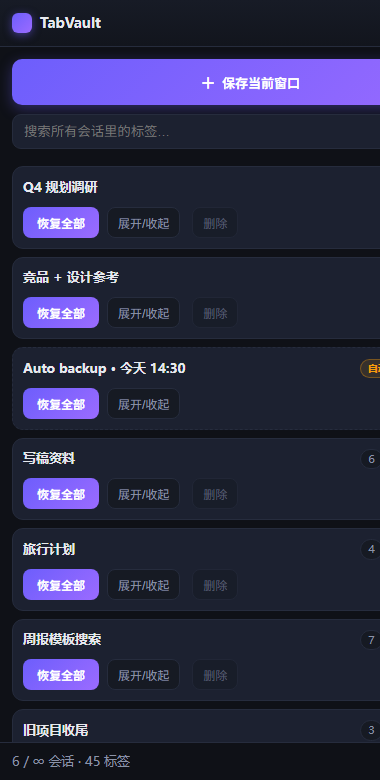
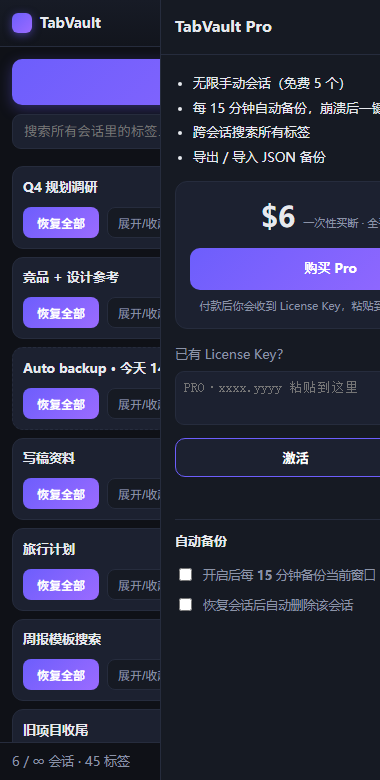

# TabVault — 标签会话管理器（Chrome 扩展）

一键把整个窗口的标签存成「会话」，随时全部恢复；Pro 每 15 分钟自动备份，
崩溃 / 误关窗口后再也不丢标签页。纯本地存储（`chrome.storage.local`）、零后端、
零第三方 API，免费 + Pro 一次性 $6 买断，Pro 用 HMAC License Key 本地验签门控。

## 界面预览

| Pro 全功能态 | 付费墙（免费用户点升级） |
|---|---|
|  |  |

> 本地预览：浏览器直接打开 `sidepanel.html?demo=pro`（或 `=free` / `=paywall`），
> 页面内置开发桩，不影响真实扩展环境。

---

## 1. 本地加载（先看效果）

1. Chrome 地址栏输入 `chrome://extensions`
2. 右上角打开 **开发者模式**
3. 点 **加载已解压的扩展程序** → 选择本 `tab-vault/` 目录
4. 点工具栏图标 → 侧边栏打开 → 点 **「＋ 保存当前窗口」**
5. 快捷键 `Alt+Shift+S` 同样保存当前窗口

---

## 2. 免费 / Pro 门控

| 能力 | 免费 | Pro |
|------|:---:|:---:|
| 手动保存会话、恢复全部、存后关闭 | ✅ | ✅ |
| 会话重命名 / 删除、标签数徽标 | ✅ | ✅ |
| 手动会话数量上限 | 5 | 无限 |
| 每 15 分钟自动备份（崩溃保险） | 🔒 | ✅ |
| 自动备份保留份数 | — | 20 |
| 跨会话搜索所有标签 | 🔒 | ✅ |
| 导出 / 导入 JSON 备份 | 🔒 | ✅ |

### 怎么调免费额度（改一个文件即生效）

打开 [`config.js`](config.js)，改 `FREE` 里的数字，保存后到
`chrome://extensions` 点本扩展的 **重新加载 ⟳** 即生效：

```js
FREE: {
  maxManualSessions: 5,   // ← 免费手动会话上限，改成 3 / 10 随意
  auto: false,            // ← 自动备份是否免费（建议保持 false，这是最强卖点）
  search: false,          // ← 跨会话搜索是否免费
  export: false,          // ← 导出备份是否免费
  keepAutoBackups: 1      // ← 免费版自动备份保留份数
},
AUTO_INTERVAL_MIN: 15     // ← 自动备份间隔（分钟），改成 10 更激进
```

调参建议：免费 5 个会话是「轻度用户一周够用、多窗口党当天撞墙」的位置。
上线一周后看反馈收紧或放宽；改完记得同步商店描述里的 Free/Pro 对比。

---

## 3. 文件结构

```
tab-vault/
├── manifest.json      # MV3；权限只有 storage / tabs / alarms（无 host_permissions，审核最快）
├── background.js      # service worker：自动备份 alarm、快捷键、徽标计数
├── config.js          # ★ 唯一调参点：SECRET / 收款链接 / FREE / PRO 门控
├── license.js         # HMAC-SHA256 验签（纯本地）
├── sidepanel.{html,css,js}   # 主 UI，含 ?demo= 预览桩
├── worker/            # Cloudflare Worker：/buy 跳转 Stripe、/success 验支付后签发 key
├── tools/keygen.mjs   # 手动 / 批量补发 key（客服用）
├── tools/selftest.mjs # 三端签名一致性自检
└── setup.mjs          # 交互式部署向导
```

隐私说明：所有数据只写在本机 `chrome.storage.local`，扩展不发起任何网络请求
（除用户主动点「购买」打开收款页）。`tabs` 权限用于读取标签标题与 URL 以保存会话。

---

## 4. 部署收款（首次上线，按顺序做）

```bash
cd tab-vault
node -e "console.log(require('crypto').randomBytes(24).toString('hex'))"   # 换新 SECRET，同步到 config.js
node tools/selftest.mjs        # 必须 6/6 PASS 再继续
cd worker && npx wrangler deploy
npx wrangler secret put LIC_SECRET          # 填 config.js 里那个 SECRET
npx wrangler secret put STRIPE_SECRET_KEY   # Stripe sk_live_...
cd .. && node setup.mjs                     # 向导：登录、部署、回填收款链接
```

Stripe 侧只需两次点击（API 改不了）：
1. 建一个 **$6 一次性** Payment Link，链接填进 `worker/wrangler.toml` 的 `STRIPE_PAYMENT_LINK`；
2. 该链接的 **After completion → Redirect to URL** 设为
   `https://tabvault-pro-api.wd933781.workers.dev/success?sid={CHECKOUT_SESSION_ID}`。

补发 key（客服 / 手动发货）：

```bash
node tools/keygen.mjs --email buyer@example.com --days 3650
```

---

## 5. 安全红线

- 真实 `SECRET` 永不进公开仓库：本仓库已对 `config.js` 执行
  `git update-index --skip-worktree config.js`，克隆后请自行填入。
- 上传商店的 zip **必然包含** 客户端 `SECRET`（纯客户端验签的固有取舍），
  因此公开代码仓库里的 `config.js` 必须是占位值。
- 客户端验签挡不住读源码的技术用户。付费用户变多后，把 `license.js` 换成
  调用 Worker 的 `/verify` 接口即可（Worker 已具备签发能力）。
